



 

<i>“In automation we trust, in bugs we despair.”</i>

 

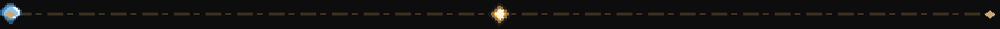

<!-- SECTION I: ABOUT ME -->

<table width="100%">
<tr>
<td width="38%" align="center" valign="middle">

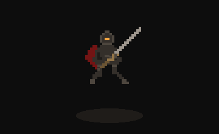  

**RADITYA BAGUS HARDANA** 
Full-Stack Developer &amp; Automation Specialist 
<code>Node.js · PHP · TypeScript · Python · Docker</code>

</td>
<td width="62%" valign="middle">

Software developer and automation engineer focused on building resilient backends, autonomous bots, and interactive web platforms. Turning complex operational workflows into clean, deterministic software that runs reliably day and night.

  

📍 **Location:** `Indonesia` &nbsp;·&nbsp; ⚡ **Specialization:** `Web Platforms · Bot Automation · AI Tools`

</td>
</tr>
</table>

<!-- SECTION II: TECH STACK -->

<!-- SECTION III: FEATURED PROJECTS -->

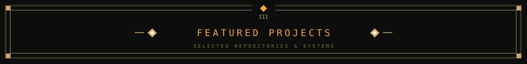

<a href="https://github.com/radityabhardana/spectre_terminal">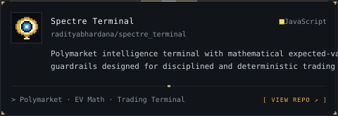</a>
<a href="https://github.com/radityabhardana/icarus-watermark-remover">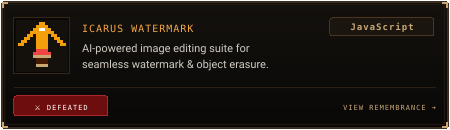</a>

<a href="https://github.com/radityabhardana/blackbox_signal_lost">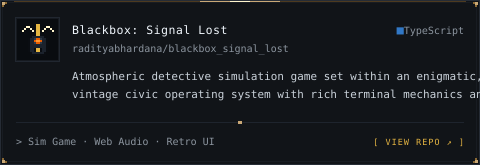</a>
<a href="https://github.com/radityabhardana/Kalpindo">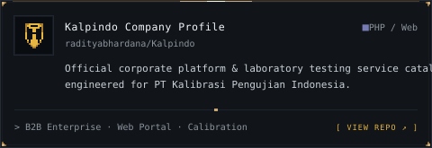</a>

<a href="https://github.com/radityabhardana/smart_study">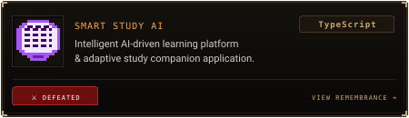</a>

<!-- SECTION IV: CONTRIBUTIONS -->

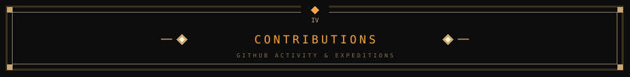

  

You died. But the code lives on.

