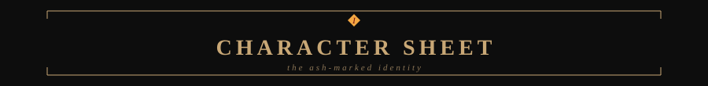
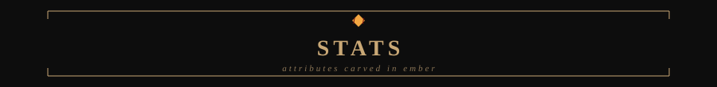
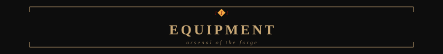
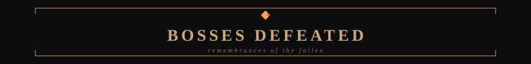
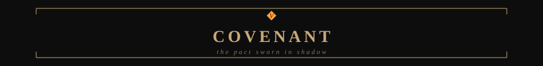
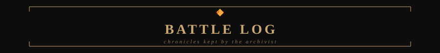
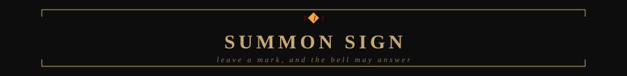

<<<<<<< HEAD

=======

>>>>>>> e4591e9c12273f087a15780b9e1d2310127c0b88

 

<<<<<<< HEAD

<table width="100%">
<tr>
<td width="34%" align="center" valign="top">

**RADITYA BAGUS HARDANA** 
Chosen Undead of Automation 
<code>Sorcerer-Pyromancer of Automation</code>

</td>
<td width="26%" align="center" valign="middle">

</td>
<td width="40%" valign="top">
=======

<i>"In automation we trust, in bugs we despair."</i>

  

 

 

## ⚱️ CHARACTER SHEET

<table width="100%">
<tr>
<td width="22%" align="center" valign="middle">

 <b>RADITYA BAGUS HARDANA</b>
 Chosen Undead of Automation

</td>
<td width="8%" align="center" valign="middle">
>>>>>>> e4591e9c12273f087a15780b9e1d2310127c0b88

</td>
<td width="70%" valign="middle">

*An ash-marked web developer, sworn to the quiet machinery beneath the keep. PHP and Node.js answer his hand; JavaScript gives motion to the hollow forms. From MySQL he draws memory, and through Docker he seals each vessel. His bots toil where men would falter — whether craft or curse, none can say.*

**Bonfire lit at:** Jakarta, Indonesia

**BONFIRE LIT AT: [YOUR_CITY]**

</td>
</tr>
</table>

<<<<<<< HEAD

| Attribute | Meaning | Level | Progress |
|:--|:--|:--:|:--|
| **VIGOR** | Work and lembur resilience | **45/99** | `█████████░░░░░░░░░░░` |
| **ENDURANCE** | Coding consistency | **52/99** | `██████████░░░░░░░░░░` |
| **INTELLIGENCE** | Automation and AI craft | **61/99** | `████████████░░░░░░░░` |
| **DEXTERITY** | Development speed | **48/99** | `██████████░░░░░░░░░░` |

=======
 

## 🔥 STATS

| Attribute | Meaning | Level | Progress |
|---|---|---|---|
| **VIGOR** | Work & lembur resilience | `45/99` | ██████████░░░░░░░░░░░ |
| **ENDURANCE** | Coding consistency | `52/99` | ███████████░░░░░░░░░░ |
| **INTELLIGENCE** | Automation & AI craft | `61/99` | █████████████░░░░░░░░ |
| **DEXTERITY** | Development speed | `48/99` | ██████████░░░░░░░░░░░ |

 

## ⚔️ EQUIPMENT

<table width="100%">
<tr>
<td width="25%" valign="top">

**WEAPON**
 
 
 

</td>
<td width="25%" valign="top">

**CATALYST**
 
 

</td>
<td width="25%" valign="top">

**ARMOR SET**
 
 

</td>
<td width="25%" valign="top">

**RING**
 
 

</td>
</tr>
</table>

 

 

## 🗡️ BOSSES DEFEATED
>>>>>>> e4591e9c12273f087a15780b9e1d2310127c0b88

| Boss | Remembrance | Fate |
|---|---|---|
| **[PROJECT_NAME]** | *[SHORT_DESCRIPTION]* |  |
| **[PROJECT_NAME]** | *[SHORT_DESCRIPTION]* |  |
| **[PROJECT_NAME]** | *[SHORT_DESCRIPTION]* |  |
| **[PROJECT_NAME]** | *[SHORT_DESCRIPTION]* |  |

<<<<<<< HEAD

=======
 

> **⚱️ Covenant of the Automatons** — AI-powered bots that toil while the host sleeps. The pact is unbroken; the ember is watched.
>>>>>>> e4591e9c12273f087a15780b9e1d2310127c0b88

 

<<<<<<< HEAD

<i>The golden sign glows faintly. Leave a mark, and the bell may answer.</i>

=======
## 📜 GITHUB STATS

 

 

## 🔔 SUMMON SIGN

<i>The golden sign glows faintly. Leave a mark, and the bell may answer.</i>

  

 

>>>>>>> e4591e9c12273f087a15780b9e1d2310127c0b88

You died. But the code lives on.
<<<<<<< HEAD

=======
>>>>>>> e4591e9c12273f087a15780b9e1d2310127c0b88

