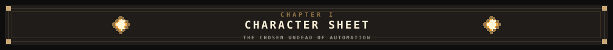
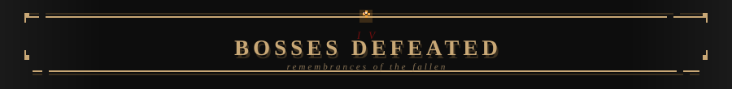
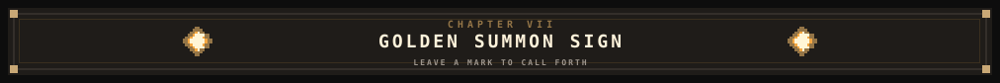



 

<i>“In automation we trust, in bugs we despair.”</i>

 

<table width="100%">
<tr>
<td width="34%" align="center" valign="top">

**RADITYA BAGUS HARDANA** 
Chosen Undead of Automation 
<code>Sorcerer-Pyromancer of Automation</code>

</td>
<td width="26%" align="center" valign="middle">

</td>
<td width="40%" valign="top">

*An ash-marked web developer, sworn to the quiet machinery beneath the keep. PHP and Node.js answer his hand; JavaScript gives motion to the hollow forms. From MySQL he draws memory, and through Docker he seals each vessel. His bots toil where men would falter. Whether craft or curse, none can say.*

**Bonfire lit at:** `[YOUR_CITY]`

</td>
</tr>
</table>

| Attribute | Meaning | Level | Progress |
|:--|:--|:--:|:--|
| **VIGOR** | Work and lembur resilience | **45/99** | `█████████░░░░░░░░░░░` |
| **ENDURANCE** | Coding consistency | **52/99** | `██████████░░░░░░░░░░` |
| **INTELLIGENCE** | Automation and AI craft | **61/99** | `████████████░░░░░░░░` |
| **DEXTERITY** | Development speed | **48/99** | `██████████░░░░░░░░░░` |

| Boss | Remembrance | Fate |
|:--|:--|:--:|
| **[PROJECT_NAME]** | *[SHORT_DESCRIPTION]* |  |
| **[PROJECT_NAME]** | *[SHORT_DESCRIPTION]* |  |
| **[PROJECT_NAME]** | *[SHORT_DESCRIPTION]* |  |
| **[PROJECT_NAME]** | *[SHORT_DESCRIPTION]* |  |

> **Covenant of the Automatons** — AI-powered bots that toil while the host sleeps. The pact is unbroken; the ember is watched.

<i>The golden sign glows faintly. Leave a mark, and the bell may answer.</i>

You died. But the code lives on.

