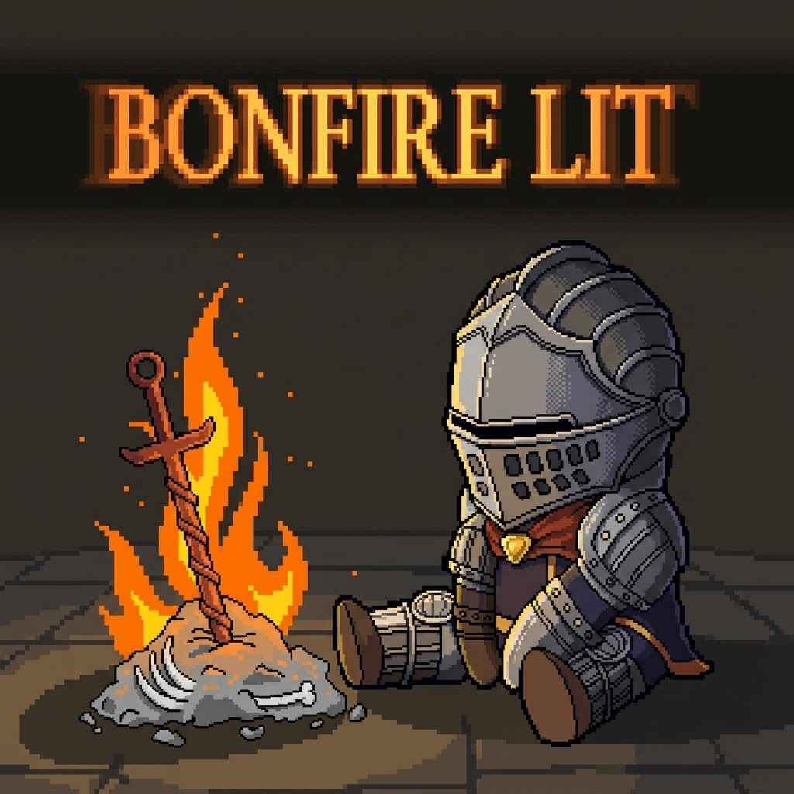
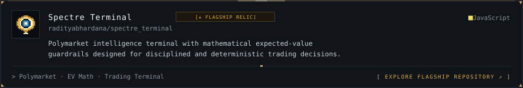
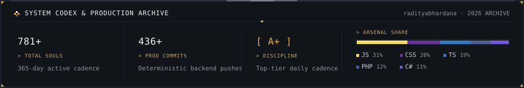

 

 

<i>“In automation we trust, in bugs we despair.”</i>

 

 

<!-- SECTION I: ABOUT ME -->

<table width="100%">
<tr>
<td width="34%" align="center" valign="middle">

</td>
<td width="66%" valign="middle">

### Raditya Bagus Hardana
Full-Stack Developer &amp; Automation Specialist

 

Software developer and automation engineer focused on building resilient backends, autonomous bots, and interactive web platforms. Turning complex operational workflows into clean, deterministic software that runs reliably day and night.

 

- 📍 **Location:** Indonesia
- ⚡ **Specialization:** Bot Automation · High-Throughput Backends · AI Pipelines
- 🔨 **Current Quest:** Architecting deterministic trading bots &amp; autonomous AI workflows
- ☀️ **Covenant:** Warrior of Sunlight — *“Praise the Sun &amp; Jolly Cooperation!”* \ [T] /
- 🗡️ **Philosophy:** Deterministic machinery that endures without supervision.

</td>
</tr>
</table>

 

<!-- SECTION II: TECH STACK -->

CORE TECHNOLOGIES &amp; ARSENAL

 

<!-- SECTION III: FEATURED PROJECTS -->

<!-- 1. Flagship Full-Width Showcase Card -->

  

<!-- 2. Symmetrical 2x2 Grid -->

 

 

<!-- SECTION IV: CONTRIBUTIONS -->

<!-- GitHub Contribution Snake Animation -->
<picture>
  <source media="(prefers-color-scheme: dark)" srcset="./assets/scenes/github-contribution-grid-snake-dark.svg">
  <source media="(prefers-color-scheme: light)" srcset="./assets/scenes/github-contribution-grid-snake.svg">
  
</picture>

  

<!-- Bespoke Dark Souls Engineering Activity & Production Codex -->

 

<!-- FOOTER: TRANSMISSIONS & JOLLY COOPERATION -->

 

<i>“The sun is a wondrous body. Like a magnificent father! If only I could be so grossly incandescent!”</i>

 

  

 

You died. But the code lives on.

